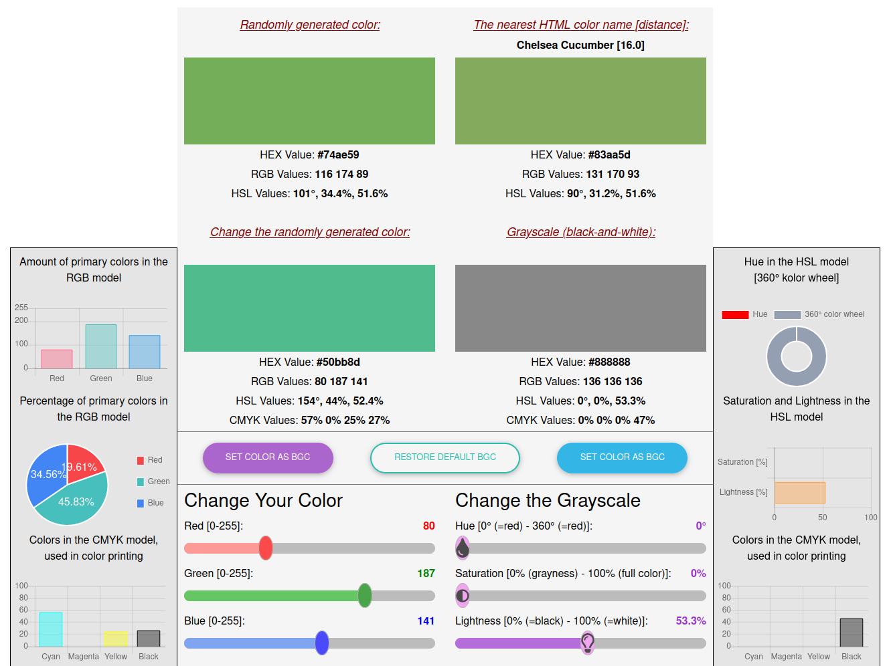

# Random Color Generator

This is a random color generator and color modifier. Bootstrap material was used to build the application.

Link to the application: [https://test-proj-gda4.web.app/](https://test-proj-gda4.web.app/)

## Description

The application generates one of 16.777 million colors and queries <https://www.thecolorapi.com> for the nearest HTML color
with the name. Then you can change the color with the RGB sliders. The color changes continuously and is displayed in
grayscale next to it. The grayscale can be changed using the HSL sliders. All values are converted on an ongoing basis: #HEX,
RGB, HSL and CMYK. There are generated on an ongoing basis RGB, CMYK charts, Hue circle and Saturation and Lightness charts.
Bootstrap Material was used to build the application. I wrote the conversion functions myself.

## Notes/ ToDo List/ Issues

1. Used pseudo-elements that Chrome does not support, but the application works fine.

## ScreenShots

## Built With

- [Font Awesome](https://fontawesome.com/) - Symbols and fonts,
- [Bootstrap Material](https://mdbootstrap.com/) and [Bootstrap](https://getbootstrap.com/) - UI elements and charts.

## License

[MIT](https://choosealicense.com/licenses/mit/)
